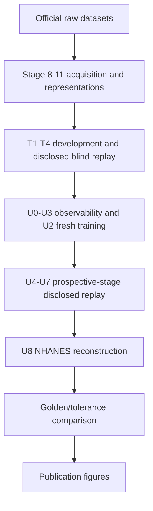

# End-to-end reproduction contract

## What “end to end” means here

The package now distinguishes four levels of evidence:

| Profile | Starts from | Retrains | Produces | Intended use |
|---|---|---:|---|---|
| `audit` | source and manifests | No | integrity ledger | code/provenance review |
| `smoke` | one official public dataset | Yes, small model | metrics + ROC | environment sanity check |
| `frozen` | canonical result ZIPs | No | all publication figures | fastest reviewer verification |
| `full-claim` | official/public or user-authorized raw assets | Yes | T/U replay, comparison report, figures | deepest claim-path reconstruction |
| `historical-replay` | full path plus legacy raw assets | Yes | failed/superseded branches too | discovery-history audit |

The authoritative machine-readable graph is
`provenance/reproduction_dag.json`. The accepted `full-claim` plan currently has 55
ordered nodes. The principal flow is:

## Immutable originals and runtime adapters

Files under `legacy/original_authoritative/` are imported evidence. Files under
`legacy/extracted_authoritative/` are byte-exact decoded payloads whose SHA-256 is
recorded in `provenance/extracted_payloads_manifest.csv`.

The runner never edits those sources. It creates two separate runtime views:

1. an unchanged `05_Code/Cross_Modal` mirror, so historical self-hash commitments
   continue to read the original bytes; and
2. adapted execution copies in the run directory, where Colab mount calls and
   `/content/drive/...` paths are redirected to an isolated local work tree.

Every source/adapted hash and replacement count is written to
`adapted_source_manifest.json`. Notebook-container drift caused by saved Colab
outputs is recorded separately in `provenance/container_revision_audit.json`; when
the embedded pipeline matches the release-manifest hash, that extracted pipeline is
the execution authority.

## Training and nondeterminism

U2 has two distinct assets and checks:

- the authoritative epoch-12 checkpoint and 38 environment prediction caches support
  the frozen fast route;
- the full route calls the continuation training entry point in a fresh data root,
  so training runs again rather than silently installing the authoritative weights.

GPU kernels, BLAS implementations and library builds can prevent model-file byte
identity even with fixed seeds. Therefore checkpoint SHA equality is explicitly not
an acceptance criterion for a fresh training replay. Target roster, sample counts,
governance decisions and structural fields are exact; performance metrics use the
tolerances in `provenance/replay_acceptance_rules.json` and are reported target by
target.

U3-U7 train their source models inside their original scripts. U8 downloads the
official CDC files, reproduces the pre-outcome assets, requires the frozen 19,097-row
target-score commitment, and then runs the disclosed post-unseal reconstruction.

## Resume, logging and failure semantics

Each run writes:

- `run_state.json` with environment, governance classification and per-stage state;
- `logs/<stage>.log` with the command output and log SHA-256;
- an authoritative code-mirror manifest;
- an adapted-source manifest;
- scientific outputs inside the isolated project work tree;
- a replay comparison report after U8;
- replay-derived figures after all comparisons pass.

A completed stage is skipped only when `--resume` is given and the ledger says
`COMPLETE`. Missing terms, raw assets, network authority, MATLAB or Python packages
produce a typed blocking state. The runner never converts those conditions into a
pass.

## What is not automatic

- Accepting Kaggle, PhysioNet, challenge, author-request or other provider terms.
- Redistributing raw data whose terms do not permit it.
- Treating retrospective replay as a new prospective experiment.
- Running U9/eICU.
- Deleting Drive or GitHub content.

Those boundaries are deliberate reproducibility controls, not missing scientific
steps.
